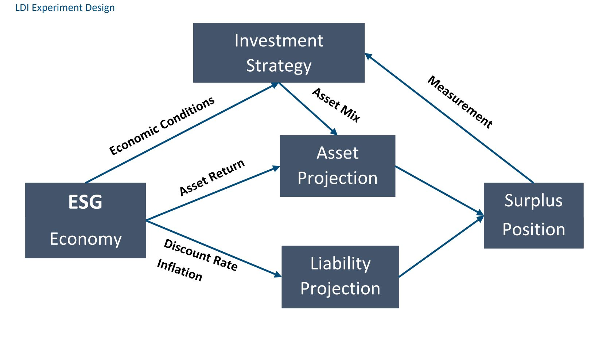

---
output:
  md_document:
    variant: markdown_github
---

# 2 Liability-Driven Investment problem

These notes are from reading [Section 2](https://www.soa.org/4964e1/globalassets/assets/files/resources/research-report/2021/liability-driven-investment.pdf).

# 2.1 LDI Analytic Framework

Key drivers of liability risk are

-   `Discount rate` - Refers to discounting back expected future benefit payments. Often associated with interest rates.\
-   `Inflation` - Certain liability payments may be adjusted according to inflation, which affects the liability value\
-   `Claim rate` - The probability that an insurance claim or pension benefits will be paid\
-   `Policyholder behaviors` - Insurance products are generally long-term products that can be affected by a policyholder's usage, financial situation, etc.

Modeling the relationship between assets and liabilities is difficult in extreme scenarios using traditional methods that rely on things like correlation coefficients, since the level of dependency between assets and liability usually increases. Some approaches also focus on the current status of a liability portfolio but lack the ability to incorporate its evolution.

Lastly, institutions will trade part of the security in investing in certain assets for riskier ones with expected higher returns (hedging ratio).

This motivates using an AI approach as a type of `dynamic optimization method` that can include the evolution of the liability, the nonlinear relationship between asset and liability, and an institution's `risk appetite`.

# 2.2 Experiment

The end goal is to optimize the investment strategy. It is directly impacted by the `economic scenario generator` through economic conditions and indirectly by the asset and liability projections. The experiment design shown in the paper below.

## 2.2.1 Economic Scenario Generation 

Principles that will be followed for structuring the ESG:

- It should be informed by a holistic view of the economy so that patterns (historical or expected to happen) are properly included

- It should share a nonlinear relationship among economic factors and asset returns so that the [tail risk](https://en.wikipedia.org/wiki/Tail_risk) can be analyzed. Tail risks are very difficult to measure.  

- It should consider asset return scenarios rather than only calibrating based on asset market prices. 

- It should utilize economic cycles since evaluating LDI strategies may take a longer period than e.g. a typical one-year time horizon that stochastic scenarios use. 

## 2.2.2. Asset and Liability Projection

The evolution of the asset and liability portfolios must include the following considerations: 

- Asset mix of the portfolio\
- Reinvestment strategy\
- Sell orders\
- Asset value\

